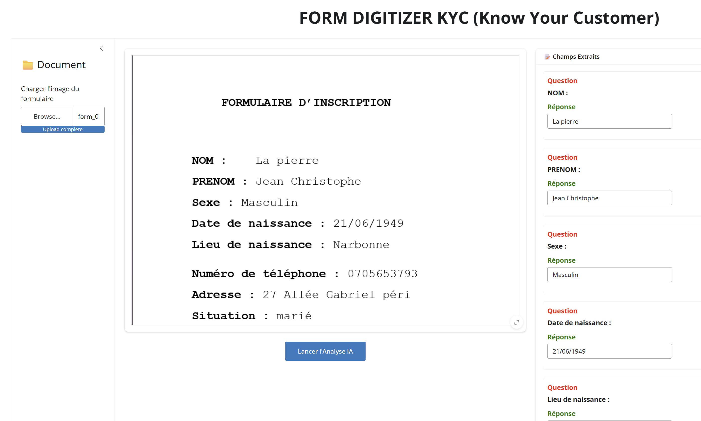

# 📑 Form Digitizer KYC (LayoutLMv3)

This project is a technical demonstration of a Named Entity Recognition (NER) pipeline applied to KYC (Know Your Customer) documents. It leverages deep learning to automate the extraction and structuring of data from printed or handwritten forms.

---

### 📸 Application Preview
<p align="center">
  
</p>

---

## 🧠 AI Model & Fine-Tuning
The core of the application is built on the **LayoutLMv3** architecture, a state-of-the-art multimodal model that processes text, image, and layout information simultaneously.

* **Dataset**: The model was **fine-tuned on a custom dataset of 200 KYC forms**.
* **Labeling Strategy**: Data was annotated using the **BIO (Begin, Inside, Outside) tagging standard**, ensuring high precision in identifying specific entities like Name, Surname, and Address.
* **Model Hosting**: The final weights are hosted on the **Hugging Face Hub** ([tourki24/kyc-layoutlmv3-digitizer](https://huggingface.co/tourki24/kyc-layoutlmv3-digitizer)).
* **MLOps Workflow**: The backend automatically pulls the model weights from the Hub upon the first launch. A Docker volume is utilized for model caching to ensure rapid subsequent startups and minimize network overhead.

## 🛠️ Technical Stack
* **AI Framework**: Transformers (Hugging Face), PyTorch.
* **Inference Engine**: FastAPI (High-performance Backend).
* **Interface**: Shiny for Python (Reactive Frontend).
* **OCR**: Tesseract OCR (for bounding box detection).
* **Containerization**: Docker & Docker Compose (Micro-services architecture).

## 🚀 Quick Start

The project is fully containerized for easy deployment. Launch the entire environment with a single command:

```bash
docker compose up --build
Once the build is complete:

User Interface: Access at http://localhost:8080

API Documentation (Swagger): Access at http://localhost:8000/docs

🧪 How to test?
For a quick evaluation, a test_images/ directory is included with sample forms:

Open the UI at port 8080.

Click "Browse..." and select an image from test_images/.

Click "Lancer l'Analyse IA" (Run AI Analysis).

The model will automatically extract and populate the fields.

📬 Contact Me
Developed by Mahmoud Tourki